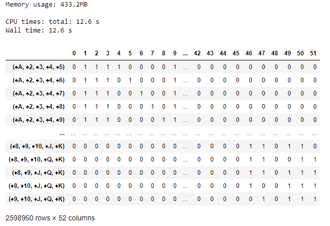
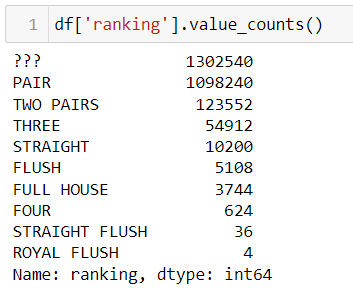
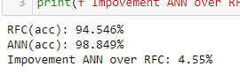

# Poker
## [FILE](https://drive.google.com/drive/folders/1w6PQbn18IxupROkAhsxvVtzbbE1LD_-C?usp=sharing) 640MB of possible poker-hands
#### If you check `visualization.ipynb` you will see:

- `2'598'960 hand variations`

## As we see

## *Some Models*

- `RFC - RandomForestClassifier(the simplest)`
- `ANN - "DEEP"(w/64 neurons) Neural Network`

