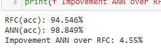
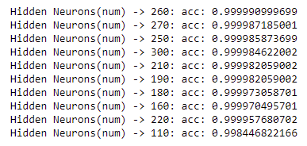

# Poker
## [DATASETS](https://drive.google.com/drive/folders/1w6PQbn18IxupROkAhsxvVtzbbE1LD_-C?usp=sharing) 
### 1. *`2'598'960` combinations of possible poker hands (5 cards)* `~630MB`

* *poker hands by name*

### 2. *Sorted poker hands (5 cards)* `~110MB`

### 3. *Building Models to classify*

- `RFC - RandomForestClassifier(the simplest)`
- `ANN - "DEEP"(w/64 neurons) Neural Network`
#### *HyperParameter Tuning*

- `The goal is to find balance between this SHAPE-NUMBER and ACCURACY-SCORE`
